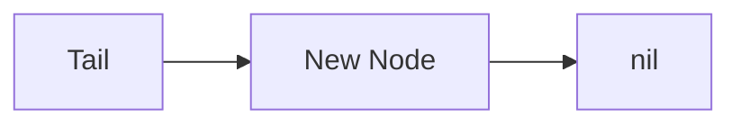
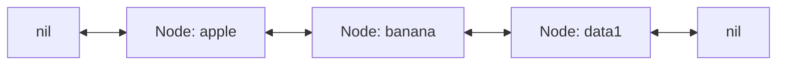
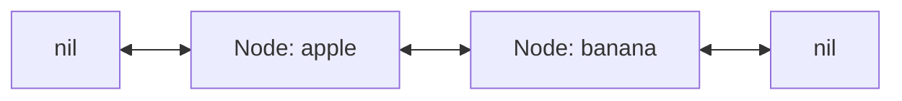

# Implementing a Double Linked List in Go

A **double linked list** (or doubly linked list) is a data structure where each node points to both its **previous** and **next** node.
This makes insertion and deletion more efficient than a single linked list because we can traverse in both directions.

🔸 Full source code available here:
[GitHub – container/double_linkedlist](https://github.com/MiladCodeLab/golang/tree/main/container/double_linkedlist)

---

## Introduction

### Why use a Double Linked List?
- Constant time **append** and **prepend** operations.
- Efficient **deletions** from both ends.
- Bi-directional traversal.

Here’s a visualization:

```mermaid
graph LR
    A["nil"] <--> B["Node: apple"] <--> C["Node: banana"] <--> D["Node: data1"] <--> E["nil"]
````

---

## Step 1: Defining the Node

Each node holds:

* The data (`string` in this example).
* A pointer to the **next** node.
* A pointer to the **previous** node.

```go
type node struct {
    Data string
    next *node
    prev *node
}
```

---

## Step 2: The DoubleLinkedlist Structure

We maintain:

* A head pointer.
* A tail pointer.
* The current size.

```go
type DoubleLinkedlist struct {
    head *node
    tail *node
    size int
}
```

---

## Step 3: Append & Prepend

Adding to the end (`Append`) or start (`Prepend`) is **O(1)**.

```go
func (l *DoubleLinkedlist) Append(d string) { ... }
func (l *DoubleLinkedlist) Prepend(d string) { ... }
```

### Visualization of Append



---

## Step 4: Pop & Shift

* **Pop** removes from the tail.
* **Shift** removes from the head.

```go
func (l *DoubleLinkedlist) Pop() (string, error) { ... }
func (l *DoubleLinkedlist) Shift() (string, error) { ... }
```

---

## Step 5: Delete by Index

We can remove a node at any index by traversing from either head or tail (whichever is closer).
This makes deletion efficient.

```go
func (l *DoubleLinkedlist) Del(idx int) error { ... }
```

---

## Step 6: Access by Index

```go
func (l *DoubleLinkedlist) Get(idx int) (string, error) { ... }
```

---

## Step 7: Iteration

We provide two iterators:

* `Iter()` → yields just the values.
* `Iter2()` → yields index and values.

```go
func (l *DoubleLinkedlist) Iter() iter.Seq[string] { ... }
func (l *DoubleLinkedlist) Iter2() iter.Seq2[int, string] { ... }
```

---

## Step 8: Example Usage

```go
func main() {
    l := new(DoubleLinkedlist)
    l.Append("data 1")
    l.Append("data 5")
    l.Append("data 2")
    l.Append("data 9")
    l.Append("data 100")

    fmt.Println("*****Get*****")
    val, err := l.Get(0)
    fmt.Println(val, err)

    fmt.Println("*****Prepend*****")
    l.Prepend("banana")
    l.Prepend("apple")

    fmt.Println("*****Del*****")
    err = l.Del(1)
    fmt.Println(err)

    fmt.Println("*****Len*****")
    fmt.Println(l.Len())

    fmt.Println("*****Iter*****")
    for data := range l.Iter() {
        fmt.Println(data)
    }

    fmt.Println("*****Iter2*****")
    for i, data := range l.Iter2() {
        fmt.Println(i, " ", data)
    }
}
```

---

## Visualization of Operations

### Prepend Example



### Pop Example



---

## Conclusion

We’ve implemented a **Double Linked List in Go** with:

* **Append, Prepend** (O(1))
* **Pop, Shift** (O(1))
* **Delete by index** (O(n/2))
* **Iteration support**

🔸 Full implementation:
[GitHub – container/double\_linkedlist](https://github.com/MiladCodeLab/golang/tree/main/container/double_linkedlist)
