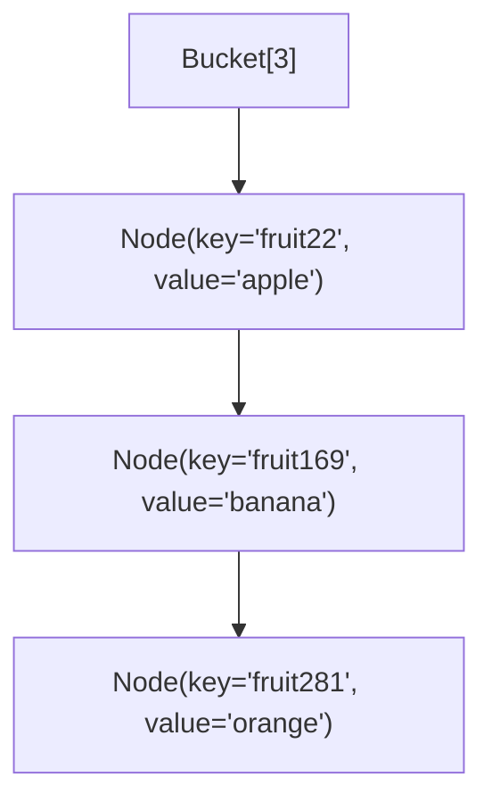
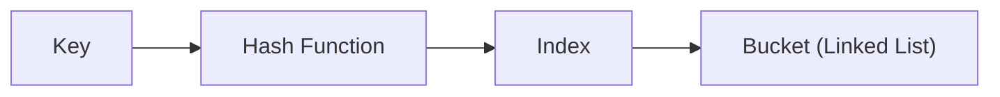

# Hash Map in Go

A **hash map** (also known as a hash table) is a data structure that stores key-value pairs and provides near O(1) average time complexity for insertion, lookup, and deletion.

In this article, we’ll walk through a simple implementation of a hash map in **Go**, explain each part step by step, and visualize how it works.

🔸 The full source code for this implementation can be found here:  
[GitHub – golang/container/hashmap](https://github.com/MiladCodeLab/golang/tree/main/container/hashmap)

---

## Introduction

The idea behind a hash map:

1. A **hash function** converts a key into an index.  
2. We use this index to place the value into a **bucket**.  
3. If multiple keys map to the same index (a **collision**), we handle it using **linked lists**.  

Here’s a visual overview:

```mermaid
graph TD
    A["Key: 'fruit94'"] --> B["Hash Function"]
    B --> C["Index 7"]
    C --> D["Bucket[7] -> Node(key='fruit94', value='cucumber')"]
````

---

## Step 1: Defining the Node & List

Each bucket is a **linked list** of nodes.

```go
type node struct {
    key   string
    value string
    next  *node
}
type list struct {
    head *node
}
```

---

## Step 2: Defining the HashMap

We store:

* A slice of lists (`list []*list`)
* The current size (number of elements)
* The capacity (number of buckets)

```go
type HashMap struct {
    list     []*list
    size     int
    capacity int
}
```

---

## Step 3: Creating a New HashMap

```go
func NewHashMap(capacity int) *HashMap {
    return &HashMap{
        list:     make([]*list, capacity),
        size:     0,
        capacity: capacity,
    }
}
```

---

## Step 4: The Hash Function

We’ll use **FNV hash** to turn a string into an integer index.

```go
func (_ *HashMap) hashFunction(key string) uint32 {
    h := fnv.New32a()
    h.Write([]byte(key))
    return h.Sum32()
}
```

---

## Step 5: Adding Elements

When inserting:

1. Compute the index.
2. If the bucket is empty → insert.
3. If the bucket already has nodes → traverse and check for duplicates, then append.

```go
func (h *HashMap) Add(key string, value string) error {
    idx := int(h.hashFunction(key)) % h.capacity
    newNode := &node{key: key, value: value}

    if h.list[idx] == nil {
        h.list[idx] = &list{head: newNode}
        h.size++
        return nil
    }

    curr := h.list[idx].head
    for curr != nil {
        if curr.key == key {
            return fmt.Errorf("duplicate key: %s", curr.key)
        }
        if curr.next == nil {
            curr.next = newNode
            h.size++
            return nil
        }
        curr = curr.next
    }
    return nil
}
```

---

## Step 6: Retrieving Elements

```go
func (h *HashMap) Get(key string) (string, error) {
    idx := int(h.hashFunction(key)) % h.capacity
    if h.list[idx] == nil {
        return "", fmt.Errorf("not found: %s", key)
    }
    curr := h.list[idx].head
    for curr != nil {
        if curr.key == key {
            return curr.value, nil
        }
        curr = curr.next
    }
    return "", fmt.Errorf("not found: %s", key)
}
```

---

## Step 7: Deleting Elements

```go
func (h *HashMap) Del(key string) error {
    idx := int(h.hashFunction(key)) % h.capacity
    if h.list[idx] == nil {
        return fmt.Errorf("not found: %s", key)
    }
    curr := h.list[idx].head
    var prev *node
    for curr != nil {
        if curr.key == key {
            if prev == nil {
                h.list[idx].head = curr.next
            } else {
                prev.next = curr.next
            }
            h.size--
            return nil
        }
        prev = curr
        curr = curr.next
    }
    return fmt.Errorf("not found: %s", key)
}
```

---

## Step 8: Iterating Over the HashMap

```go
func (h *HashMap) Iter() iter.Seq2[string, string] {
    return func(yield func(string, string) bool) {
        for _, v := range h.list {
            if v == nil {
                continue
            }
            for n := v.head; n != nil; n = n.next {
                if !yield(n.key, n.value) {
                    return
                }
            }
        }
    }
}
```

---

## Visualization of Collisions

When multiple keys hash to the same index, they form a linked list in the bucket.



---

## Step 9: Example Usage

```go
func main() {
    mp := NewHashMap(100)

    mp.Add("fruit22", "apple")
    mp.Add("fruit169", "banana")
    mp.Add("fruit94", "cucumber")
    mp.Add("fruit281", "orange")

    fmt.Println("Get fruit94:", mp.Get("fruit94"))
    mp.Del("fruit169")
    fmt.Println("Length:", mp.Len())
}
```

---

## Conclusion

We’ve built a simple **HashMap in Go** using:

* **FNV hash function**
* **Chaining (linked list)** for collisions
* Support for **Add, Get, Del, Iter, Len**

In production, Go already provides an efficient `map` type, but building one yourself is the best way to understand how hash maps work under the hood.

🔸 Full implementation available here:
[GitHub – golang/container/hashmap](https://github.com/MiladCodeLab/golang/tree/main/container/hashmap)



